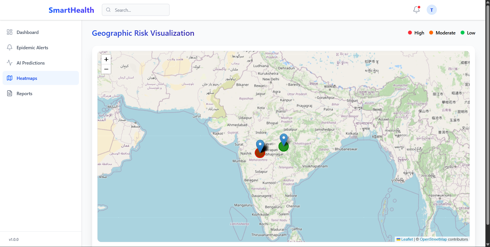

# SmartHealthML: AI-Powered Disease Outbreak Prediction

SmartHealthML is a full-stack epidemic surveillance system that leverages machine learning to predict disease outbreak risks based on environmental factors (rainfall, pH, temperature) and historical data. Built for public health officials and researchers, it provides real-time visualization, automated alerts, and detailed reports.

🌍 Why SmartHealthML?

Disease outbreaks are heavily influenced by environmental conditions such as rainfall, temperature, and water quality metrics.
SmartHealthML demonstrates how machine learning can assist in:
-Early outbreak detection
-Risk-based resource allocation
-Preventive action planning
-Data-driven public health decision-making
-This project showcases applied ML + full-stack system design for real-world impact.

## 🚀 Features

- **Outbreak Prediction**: Calibrated Random Forest model predicting risk levels (Low, Moderate, High).
- **Interactive Heatmap**: Visual representation of risk across different states/regions using Leaflet.
- **Alert System**: Automated triggers for high-risk scenarios.
- **Backend API**: Robust Flask API with SQLite persistence and XAI (Explainable AI) capabilities.
- **Modern UI**: Responsive dashboard built with React, Vite, and Tailwind CSS.

## 🛠️ Tech Stack

- **Frontend**: React 19, TypeScript, Vite, Tailwind CSS, Leaflet, Chart.js.
- **Backend**: Flask, SQLAlchemy, Scikit-learn, Pandas.
- **Database**: SQLite (Development).
- **ML Model**: Random Forest (Calibrated Classifier).

## 📂 Project Structure

```text
SmartHealthML/
├── Backend/          # Flask API, SQL models, and routes
├── Frontend/         # React + Vite application
├── models/           # Trained ML models (.pkl files)
├── data/             # Historical and synthetic datasets
├── notebooks/        # Data exploration and training logs
├── scripts/          # Organized utility scripts
│   ├── training/     # Model training and calibration
│   ├── utils/        # Data generation and prediction helpers
│   ├── testing/      # API and system verification
│   └── archive/      # Legacy script versions
└── .gitignore        # Project-level git configuration
```

## ⚙️ Setup & Installation

### Backend Setup
1. Navigate to the `Backend` folder:
   ```bash
   cd Backend
   ```
2. Create and activate a virtual environment:
   ```bash
   python -m venv venv
   source venv/bin/activate  # On Windows: venv\Scripts\activate
   ```
3. Install dependencies:
   ```bash
   pip install -r requirements.txt
   ```
4. Run the API:
   ```bash
   python app.py
   ```

### Frontend Setup
1. Navigate to the `Frontend` folder:
   ```bash
   cd Frontend
   ```
2. Install dependencies:
   ```bash
   npm install
   ```
3. Start the development server:
   ```bash
   npm run dev
   ```

## 📡 API Endpoints

| Method | Endpoint | Description |
| :--- | :--- | :--- |
| `POST` | `/predict` | Predict risk level based on environmental data |
| `GET` | `/heatmap-data` | Retrieve risk data for the interactive map |
| `GET` | `/report-summary` | Get statistical summary of all predictions |
| `GET` | `/alerts` | Fetch recent high-risk alerts |

## 🧠 ML Model Management

The project uses a **Calibrated Random Forest** model (`models/outbreak_model_v5.pkl`). 
- **Features**: Month, Rainfall, pH Level, BOD Level, Nitrate Level, Temperature.
- **Interpretability**: Includes basic XAI to identify top contributing factors in each prediction.





## 🚀 Future Improvements
- **SHAP-based explainability**
- **Real-time environmental API integration**
- **CI/CD pipeline**

---
👨‍💻 Developer

Developed by [Aditya]

