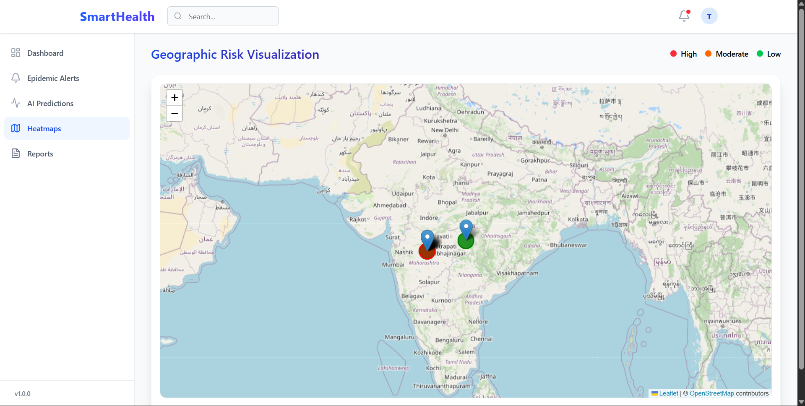

# SmartHealthML — AI-Powered Disease Outbreak Prediction

> **Version:** v1.1.0 | **Status:** Active Development

SmartHealthML is a full-stack epidemic surveillance system that leverages machine learning to predict disease outbreak risks based on environmental factors (rainfall, pH, temperature) and historical data. Built for public health officials and researchers, it provides real-time visualization, automated alerts, detailed reports, and community health awareness.

---

## 🆕 Recent Updates (v1.1.0)

### ✅ Hygiene Tips — Public Health Dashboard
- Added a dedicated **Hygiene Tips** section to the Public Dashboard.
- Displays **5 categorised health tips** (Hand Washing, Respiratory Etiquette, Surface Disinfection, Food Safety, Personal Grooming) as interactive cards.
- Each card features a **custom inline SVG illustration**, category badge, description, and a **"Read More"** link to official CDC/WHO resources.

### ✅ User Management — Admin Module
- Admin users now have a full **User Management CRUD interface** at `/admin/users`.
- Supports **Add**, **Edit**, and **Delete** operations via a polished modal form.
- Features **real-time search** by name or email.
- Role-based **colour-coded badges** (Purple / Blue / Green / Slate) and **clickable status toggles** (Active / Inactive).
- Per-role statistics row at the top of the management panel.

---

## 🚀 Features

### 🧑‍💼 Admin Module
- **User Management**: Full CRUD interface — Add, Edit, Delete, Search users. Role-based access with colour-coded badges and Active/Inactive status tracking.
- **System Dashboard**: Overview of system health, active alerts, reports filed, and activity charts.

### 👩‍⚕️ Health Officer Module
- **Outbreak Prediction**: Calibrated Random Forest model predicting risk levels (Low / Moderate / High).
- **Interactive Heatmap**: Geographic risk visualisation across Indian states using Leaflet.js.
- **Alert System**: Automated high-risk triggers and a filterable real-time alert feed.
- **Reports**: Risk distribution charts and predictions summary powered by the backend API.

### 🏥 ASHA Worker Module
- **Case Reporting**: Submit disease case reports (patient name, age, symptoms, severity, village).
- **Water Quality Logging**: Log pH, turbidity, and contamination levels for local water sources.

### 🏨 Clinic Staff Module
- Patient data management with lab report history.

### 🌍 Public Dashboard
- **Hygiene Tips**: 5 illustrated health awareness cards covering hand hygiene, respiratory etiquette, surface disinfection, food safety, and personal grooming.
- **Local Health Alerts**: Dynamically listed community warnings.
- **Emergency Helpline**: Quick-dial 108, SMS alert, and geo-location hospital finder.
- **Awareness Portal**: General health and epidemic awareness content.

---

## 🛠️ Tech Stack

| Layer | Technology |
|---|---|
| **Frontend Framework** | React 19, TypeScript, Vite |
| **Styling** | Tailwind CSS v4 |
| **Routing** | React Router DOM v7 |
| **Charts** | Recharts, Chart.js |
| **Maps** | Leaflet, React-Leaflet |
| **Icons** | Lucide React |
| **HTTP Client** | Axios |
| **Backend** | Flask 3, Flask-CORS, Flask-SQLAlchemy |
| **Database** | SQLite (dev) |
| **ML Model** | Scikit-learn (Calibrated Random Forest) |

---

## 🎨 UI/UX Design

- **Role-Based Colour Coding**: Admin (Purple), Health Officer (Blue), ASHA Worker (Green), Clinic Staff (Slate).
- **Status Badges**: Active (Green pill with dot), Inactive (Red pill with dot). Clickable to toggle directly from the table.
- **Modal-First Design**: Add/Edit operations use a focused modal with live preview of role badge.
- **Responsive Layouts**: All pages adapt from mobile to widescreen using Tailwind CSS grid/flex.
- **Inline SVG Illustrations**: Hygiene tip cards use custom vector graphics — no external image dependencies.

---

## 📂 Project Structure

```text
SmartHealthML/
├── Backend/                # Flask API, SQL models, and routes
│   ├── models/             # Prediction, Alert, Case, Water, (User – planned)
│   ├── routes/             # predict, alert, case, water, public routes
│   └── app.py
├── Frontend/               # React + Vite application (v1.1.0)
│   └── src/
│       ├── pages/
│       │   ├── admin/      # UserManagement.tsx ← NEW
│       │   ├── dashboards/ # Admin, Officer, Worker, Clinic, Public ← UPDATED
│       │   ├── alerts/     # AlertsPanel.tsx
│       │   ├── reports/    # ReportsPage.tsx
│       │   ├── forms/      # CaseReportForm, WaterQualityForm
│       │   └── visualizations/ # HeatmapView.tsx
│       ├── context/        # AuthContext (role-based)
│       ├── services/       # api.ts (Axios instance)
│       └── layouts/        # MainLayout (sidebar + nav)
├── models/                 # Trained ML models (.pkl files)
├── data/                   # Historical and synthetic datasets
└── scripts/                # Training, utils, testing
```

---

## ⚙️ Setup & Installation

### Backend
```bash
cd Backend
python -m venv venv
venv\Scripts\activate       # Windows
pip install -r requirements.txt
python app.py               # Starts on http://localhost:5000
```

### Frontend
```bash
cd Frontend
npm install
npm run dev                 # Starts on http://localhost:5173
```

---

## 📡 API Endpoints

| Method | Endpoint | Description |
|---|---|---|
| `POST` | `/predict` | Predict risk level from environmental data |
| `GET` | `/heatmap-data` | 7-day rolling risk data for the map |
| `GET` | `/report-summary` | Aggregated prediction statistics |
| `GET` | `/alerts` | Recent high-risk alerts |
| `POST` | `/cases/report` | Submit a new disease case |
| `POST` | `/water/report` | Log a water quality sample |

---

## 🧠 ML Model

- **Model**: Calibrated Random Forest (`models/outbreak_model_v5.pkl`)
- **Features**: Month, Rainfall, pH Level, BOD Level, Nitrate Level, Temperature
- **Outputs**: Risk Level (LOW / MODERATE / HIGH), Probability score, Confidence band, Top contributing factors (XAI)

---

## 📸 Screenshots





> _Screenshots for User Management and Hygiene Tips dashboard coming soon._

---

## 🔧 Functional Requirements (v1.1.0)

### User Management
- **FR-UM-01**: Admin must be able to add a new user with Name, Email, Role, and Status.
- **FR-UM-02**: Admin must be able to edit an existing user's Role or Status via a pre-filled modal.
- **FR-UM-03**: Admin must be able to delete a user after a confirmation prompt.
- **FR-UM-04**: The user table must be searchable in real-time by name or email.
- **FR-UM-05**: Edit and Delete actions must update the UI state immediately without a page refresh.
- **FR-UM-06**: Role badges must use distinct colour schemes (Purple / Blue / Green / Slate).
- **FR-UM-07**: Status must be visually represented and togglable (Active = Green, Inactive = Red).

### Hygiene Tips (Public Dashboard)
- **FR-HT-01**: The Public Dashboard must display at least 5 hygiene tip cards.
- **FR-HT-02**: Each card must include a Title, Category badge, Description, and a thematic illustration.
- **FR-HT-03**: Each tip must include a "Read More" link to a credible external health resource.
- **FR-HT-04**: The layout must be responsive across mobile and desktop screen sizes.
- **FR-HT-05**: Illustrations must use consistent visual style (flat SVG vector graphics).

---

## 🚀 Future Improvements
- **Real Authentication**: JWT-based login/register with a backend user model.
- **SHAP Explainability**: Move from feature importance to SHAP-based XAI.
- **Real-time Environmental API**: Auto-fetch rainfall/temperature from external APIs.
- **Report Export**: PDF generation for the Reports page.
- **CI/CD Pipeline**: Automated deployment on push to `main`.

---

👨‍💻 **Developed by [Aditya]** | v1.1.0
