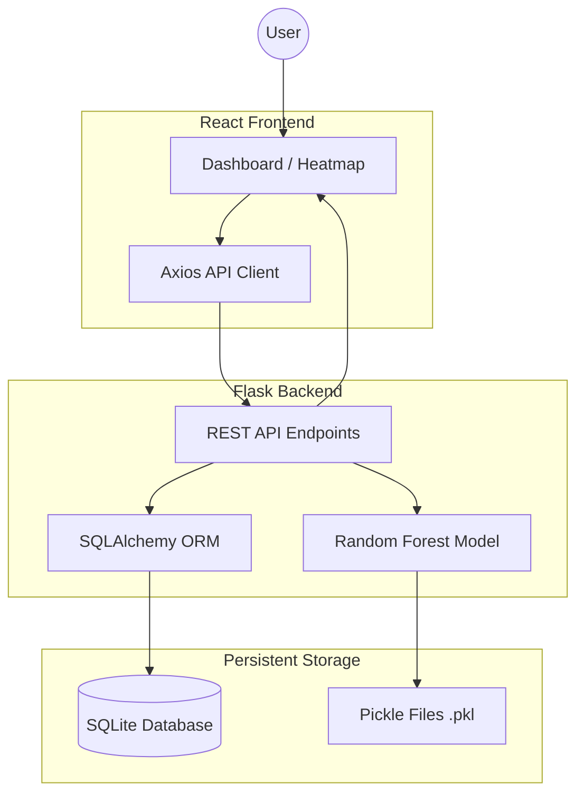

# SmartHealthML: Project Documentation

SmartHealthML is a full-stack epidemic surveillance system that leverages machine learning to predict disease outbreak risks based on environmental factors (rainfall, pH, temperature) and historical data.

---

## 1. System Architecture

The following diagram illustrates the data flow and component interaction within SmartHealthML.

### Components:
- **Frontend**: React + Vite application for real-time visualization (Leaflet, Chart.js).
- **Backend**: Flask API with SQLAlchemy for data management.
- **ML Engine**: Calibrated Random Forest Classifier for outbreak prediction.
- **Database**: SQLite for lightweight, persistent surveillance data.

---

## 2. API Reference

### Prediction Endpoints
- **POST `/predict`**: Generates a risk level prediction.
- **GET `/heatmap-data`**: Retrieves recent prediction data for the map.
- **GET `/report-summary`**: Returns aggregate statistics.

### Alerts & Data Endpoints
- **GET `/alerts`**: Fetches triggered high-risk alerts.
- **POST `/cases/report`**: Submits a new disease case record.
- **POST `/water/report`**: Submits a new water quality record.

---

## 3. Database Schema

The system uses three primary tables:
1.  **Predictions**: Stores historical environmental inputs and model outputs.
2.  **Alerts**: Logs automatically triggered high-risk notifications.
3.  **Disease Cases / Water Quality**: Stores surveillance data from field reports.

---

## 4. Machine Learning Model

- **Algorithm**: Random Forest Classifier with Calibrated Probabilities.
- **Features**: Month, Rainfall, pH Level, BOD Level, Nitrate Level, Temperature, and State.
- **Training**: Automated pipeline via `scripts/training/train_model.py`.
- **Explainability**: Identifies top-3 contributing factors for every prediction.

---

## 5. Deployment Guide

- **Frontend**: Hosted on **Vercel**. Requires `VITE_API_URL` environment variable.
- **Backend**: Hosted on **Render**. Uses a Python runtime with `pip install -r requirements.txt`.
- **Sync**: Auto-redeployments are triggered on every push to the `main` branch.
