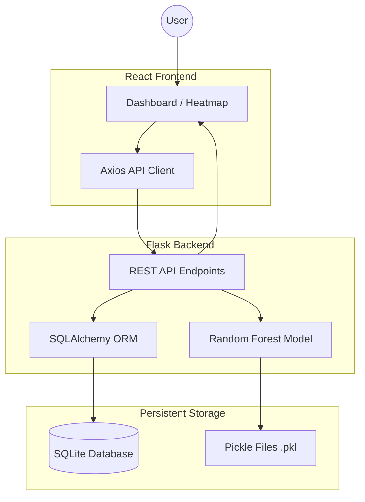

# Architecture Overview

SmartHealthML is a full-stack epidemic surveillance system designed to predict disease outbreak risks based on environmental and historical data.

## System Components

### 1. Frontend (React + Vite)
- **Role**: Handles data visualization (Leaflet heatmaps, Chart.js graphs) and user interaction.
- **State Management**: Uses React Context/State for managing global UI patterns.
- **Styling**: Tailwind CSS for responsive and modern aesthetics.

### 2. Backend (Flask)
- **Role**: Orchestrates the business logic, handles ML inference requests, and manages data persistence.
- **API**: RESTful architecture with blueprints for different domains (predictions, alerts, water data, cases).
- **Inference**: Uses `joblib` to load pre-trained Scikit-learn models for real-time risk prediction.

### 3. Machine Learning Model
- **Algorithm**: Calibrated Random Forest Classifier.
- **Purpose**: Classifies environmental input into risk levels: `LOW`, `MODERATE`, or `HIGH`.
- **Explainability**: Basic feature contribution analysis is performed during each prediction.

### 4. Database (SQLite + SQLAlchemy)
- **Role**: Stores historical predictions, environmental records, reported cases, and triggered alerts.
- **Persistence**: Ensures that data across sessions is retained for trend analysis.

## Data Flow: Outbreak Prediction
1. **Input**: User submits environmental metrics (Rainfall, pH, Temperature, etc.) via the frontend form.
2. **Request**: The frontend sends a `POST` request to the `/predict` endpoint.
3. **Inference**: Flask passes the data through the pre-trained Random Forest model.
4. **Persistence**: The result (risk level, probability) and input data are saved in the `predictions` table.
5. **Alerting**: If the risk is `HIGH`, an entry is automatically created in the `alerts` table.
6. **Response**: The API returns the risk level, confidence, and contributing factors to the frontend.
7. **Visualization**: The dashboard updates the heatmap and stats dynamically.
